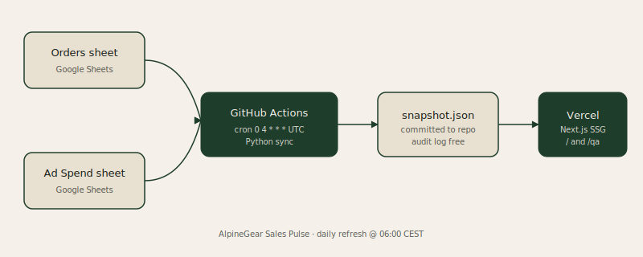

# AlpineGear · Sales Pulse

Branded daily-refreshing sales and ad-spend dashboard for AlpineGear, an outdoor retail demo brand. Built as a portfolio piece by Zdeněk Brdy.

**Live demo:** https://alpinegear-pulse.vercel.app
**Loom walkthrough:** (added after recording)

## What it does

- Pulls orders and ad-spend rows from a Google Sheet (two tabs).
- Normalizes, dedups by `order_id` (latest timestamp wins), and matches ad-spend rows to order line items by `(date, normalized product)`.
- Computes Revenue, Orders, AOV, Ad Spend, ROAS, and CAC per (product, day).
- Surfaces unmatched ad-spend rows on a separate `/qa` route so data issues are never silently dropped.
- Writes a JSON snapshot committed to the repo daily at 06:00 CEST by GitHub Actions.
- Frontend is statically generated by Next.js on Vercel and re-deploys whenever a new snapshot is committed.

## Why this architecture

Storing the snapshot in git instead of a database gives:

- Zero ongoing infra cost
- 100 percent uptime regardless of database availability
- Free audit log of every daily snapshot in git history
- Trivial portability: swap the source-sheet ID in env to repoint at any data source

For a real client with sub-minute refresh requirements the storage would move to Postgres and a long-running backend, but the pipeline shape stays the same.

## Architecture



```
[Orders sheet]      [Ad Spend sheet]
        \              /
         v            v
   [GitHub Actions @ 04:00 UTC]
                 |
                 v
   [snapshot.json commit]
                 |
                 v
        [Vercel deploy]
                 |
                 v
   [Next.js dashboard / and /qa]
```

## Tech

- Sync: Python 3.12, google-api-python-client, pytest (11 tests)
- Scheduler: GitHub Actions cron + workflow_dispatch
- Storage: JSON snapshot committed to repo, no database
- Frontend: Next.js 16 App Router, Tailwind v4, Recharts 3, deployed to Vercel
- Fonts: Fraunces serif, Inter sans, JetBrains Mono mono

## Project layout

```
sync/                  Python sync package
  pyproject.toml
  sync.py              entry point (pulls sheets, writes snapshot.json)
  normalize.py         strip + dedup by order_id
  matcher.py           explode orders to line items, match by (date, product)
  kpis.py              aggregate by (product, day), compute totals
  snapshot.py          shape the output JSON
  sheets_client.py     Sheets API readonly client
  tests/               11 pytest tests covering normalize, matcher, kpis

data/
  snapshot.json        committed, regenerated daily
  seed/
    orders_seed.py     one-time backfill of 60 days of synthetic orders
    ad_spend_seed.csv  manual paste into the Ad Spend sheet tab

.github/workflows/
  daily-sync.yml       cron 0 4 * * *, runs sync, commits snapshot, alerts Slack on failure

web/                   Next.js 16 App Router frontend
  app/
    page.tsx           server wrapper
    DashboardClient.tsx  main client component
    qa/page.tsx        unmatched-ad-spend QA route
  components/          Nav, DateRangePicker, KpiTile, ProductPills,
                       RevenueByProductChart, RevenueOverTimeChart,
                       ProductTable, NewBadge
  lib/                 types, snapshot loader, filters, format helpers

docs/
  architecture.svg     data flow diagram
  screenshots/         portfolio PNGs
```

## Repointing at your own data

1. Create a Google Sheet with two tabs named `Orders` and `Ad Spend`, using the column headers in `data/seed/orders_seed.py` and `data/seed/ad_spend_seed.csv`.
2. Create a Google service account, enable Sheets API, share the sheet with the service account email as Editor.
3. Add GitHub Secrets: `GOOGLE_SA_KEY` (the JSON key), `SHEETS_ID`, and optionally `SLACK_WEBHOOK_URL` for sync-failure alerts.
4. Trigger the workflow manually once via the Actions tab.

## Running locally

```powershell
# sync
cd sync
python -m venv .venv
.\.venv\Scripts\Activate.ps1
pip install -e ".[dev]"
pytest

# seed (one-time)
$env:GOOGLE_SA_KEY = Get-Content path\to\sa-key.json -Raw
$env:SHEETS_ID = "your-sheet-id"
python ..\data\seed\orders_seed.py

# sync produces snapshot.json
python sync.py

# frontend
cd ..\web
npm install
npm run dev
```

## License

MIT
